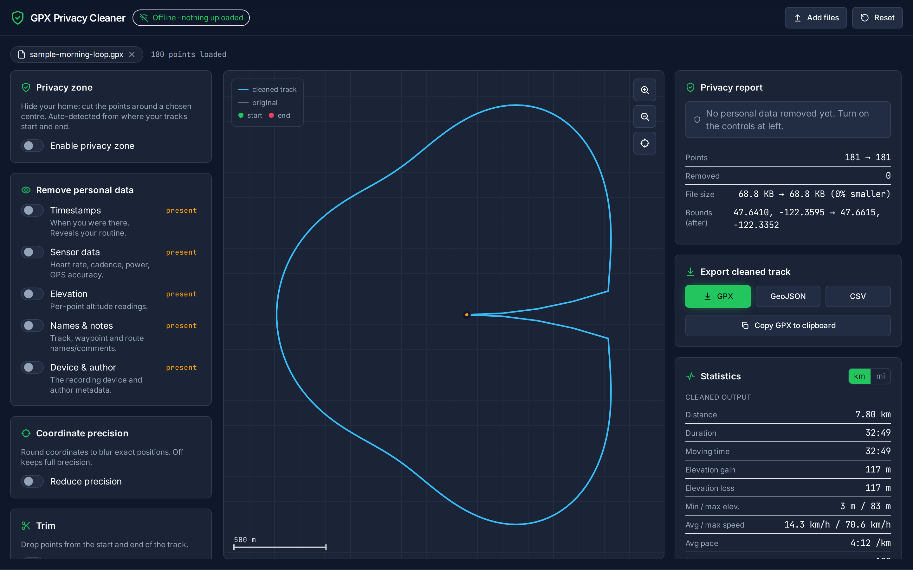
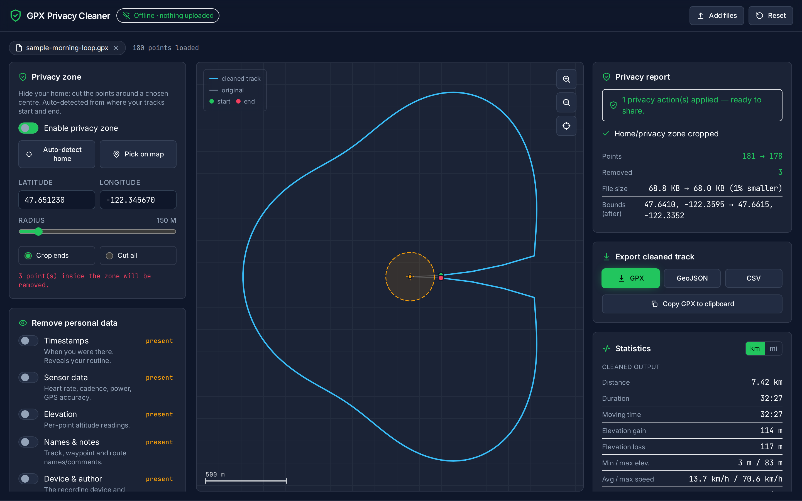

# GPX Privacy Cleaner

**Remove your home location and personal data from GPS (`.gpx`) tracks before you share them — 100% in your browser. Nothing is ever uploaded.**

GPX files exported from Strava, Garmin, Komoot or your phone embed the exact
coordinates where your run/ride started and ended (usually your home), plus
timestamps, heart-rate, device IDs and more. Sharing one can quietly reveal where
you live and when you're out. **GPX Privacy Cleaner** strips all of that out — with a
local map preview, automatic home-location detection, and a transparent
before→after privacy report — then exports a clean GPX, GeoJSON or CSV.

It is **offline by design**: the map is drawn locally on a `<canvas>`, fonts are
self-hosted, and a strict Content-Security-Policy (`connect-src 'none'`) means the
page *cannot* make a network request even if it wanted to. Your GPS data never
leaves the tab.

> **Live demo:** https://skytuhua.github.io/gpx-privacy-cleaner/



## Who it's for
Runners, cyclists, hikers, trail/ultra runners, geocachers and drone pilots who want
to publish or send a track without leaking where they live or train.

## What it does

- **Privacy zone (the headline feature).** Automatically detects the home/start-end
  cluster of your tracks and proposes a circular privacy zone. Adjust the radius,
  type coordinates, or click the map to set the centre. Two modes:
  - **Crop ends** — trims the leading/trailing points near home (the common
    anti-doxxing case).
  - **Cut all** — removes every point inside the zone, splitting the track so the
    redacted area is never bridged by a straight line.
- **Remove personal data.** Independent toggles for **timestamps**, **sensor data**
  (heart rate, cadence, power, GPS accuracy), **elevation**, **names & notes**, and
  **device & author** metadata — each with a live "present / none" inventory badge.
- **Coordinate fuzzing.** Optionally round coordinates to blur exact positions
  (with the approximate ground resolution shown).
- **Trim.** Drop points from the start and end of the track by range.
- **Simplify.** Douglas–Peucker reduction (tolerance in real metres) to shrink
  bloated files, with a live point-count and output-size preview.
- **Merge.** Combine several loaded files/tracks into one.
- **Local map preview.** Pan/zoom your route on a canvas with start/end markers, the
  privacy ring, removed points highlighted, and a scale bar — no map tiles, no
  network.
- **Live stats.** Distance, duration, moving time, elevation gain/loss, speed, pace,
  bounding box (km/mi toggle).
- **Export + privacy report.** Download clean **GPX**, **GeoJSON** or **CSV**, or
  copy the GPX. A before→after report lists exactly what was removed and how much
  smaller the file is.



## Privacy guarantees

- **No uploads, no servers, no accounts, no analytics, no telemetry.**
- **Zero network requests at runtime** — verified by an automated build guard
  (`npm run check:offline`) that fails if any network primitive ends up in the
  bundle, and enforced at runtime by a `connect-src 'none'` CSP.
- All processing is in-memory; nothing is written to storage.

## Quick start (use it)

The easiest way is the [live demo](https://skytuhua.github.io/gpx-privacy-cleaner/).
To run it yourself from the release artifact:

1. Download `gpx-privacy-cleaner-vX.Y.Z-web.zip` from the
   [latest release](https://github.com/Skytuhua/gpx-privacy-cleaner/releases) and
   unzip it.
2. Serve the folder with any static server (the strict CSP means it must be served
   over `http(s)://`, not opened via `file://`):
   ```bash
   npx serve gpx-privacy-cleaner-web      # or: python3 -m http.server -d gpx-privacy-cleaner-web
   ```
3. Open the printed URL, drop in a `.gpx` file (or click **Try it with a sample
   track**), clean it, and export.

## Build from source

Requirements: Node.js 20+.

```bash
git clone https://github.com/Skytuhua/gpx-privacy-cleaner.git
cd gpx-privacy-cleaner
npm install
npm run dev          # start the dev server (http://127.0.0.1:5173)
npm run build        # type-check, build to dist/, and run the zero-network guard
npm run preview      # preview the production build
npm test             # run the unit test suite (Vitest)
npm run lint         # ESLint + Prettier check
```

## How it works (architecture)

A dependency-light single-page app: **vanilla TypeScript + Vite + Tailwind**, no UI
framework. The pure, fully-tested core (`src/core/`) parses GPX, applies a
declarative `EditConfig` (privacy zone, strip, fuzz, trim, simplify, merge) as a
single deterministic transform, and serializes back to GPX/GeoJSON/CSV. The UI
(`src/ui/`) is a small store + imperative panels + a hand-rolled canvas renderer.
See [`ARCHITECTURE.md`](ARCHITECTURE.md) and [`SPEC.md`](SPEC.md) for details, and
[`RESEARCH.md`](RESEARCH.md) for why the product exists.

## Supported input
GPX 1.0 and 1.1 — tracks, routes, waypoints, elevation, time, and common extensions
(Garmin `TrackPointExtension`: heart rate, cadence, power, temperature; `hdop`/`vdop`
and other accuracy fields). Malformed files are handled gracefully with clear
messages.

## Limitations
- **GPX only** in v1 (no FIT/TCX import).
- The map preview shows your route geometry **without a base map** — by design, so no
  tile server is ever contacted.
- Elevation can be smoothed/removed but not *corrected* from external DEM data (that
  would require a network lookup, which this tool deliberately avoids).
- No route planning/drawing — this is a privacy *cleaner*, not a route editor.
- Because of the strict CSP, the downloadable build must be **served** over http(s),
  not opened directly from `file://`.

## License
[MIT](LICENSE) © Skytuhua
